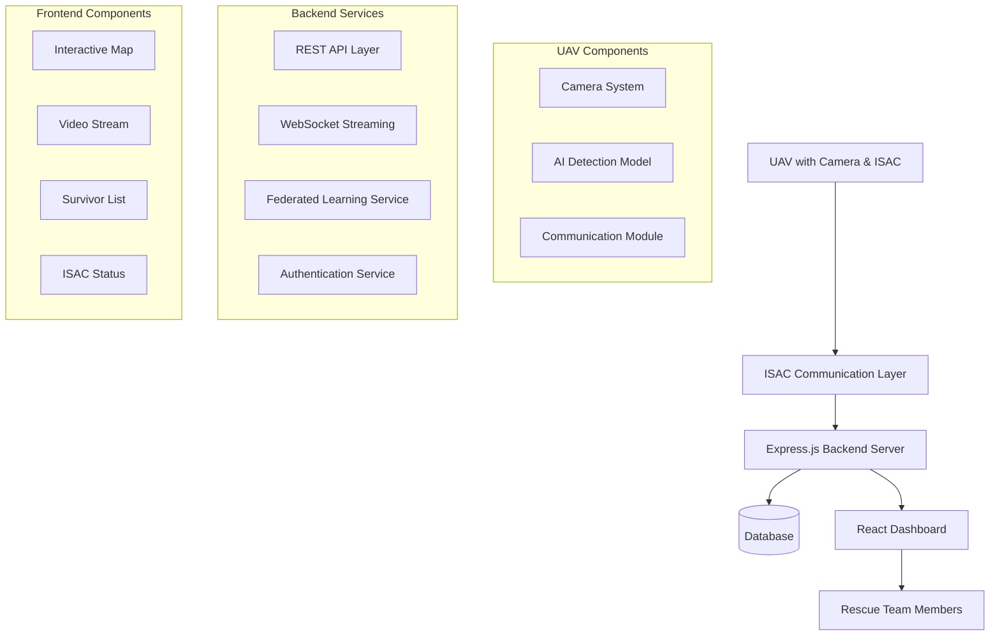

# Design Document

## Overview

The UAV-Based Disaster Imagery Analysis & Post-Rescue System is a distributed real-time application that coordinates UAV-based survivor detection with ground-based rescue operations. The system consists of three main components: UAV sensing and communication modules, a backend processing server, and a frontend rescue dashboard. The architecture leverages ISAC technology for adaptive communication, federated learning for privacy-preserving AI improvement, and real-time data streaming for immediate rescue coordination.

## Architecture

### High-Level Architecture



### Communication Flow

1. **UAV Data Collection**: UAV captures imagery and processes it through onboard AI detection
2. **ISAC Adaptation**: Communication layer determines optimal data transmission based on signal strength
3. **Backend Processing**: Express server receives data, processes it, and stores relevant information
4. **Real-time Updates**: WebSocket connections push updates to connected rescue dashboards
5. **Federated Learning**: Model improvements are computed locally and shared without raw data transmission

## Components and Interfaces

### UAV Communication Interface

**ISAC Communication Modes:**
- **Good Network Mode**: Transmits full video stream (1080p), real-time AI detections, and model updates
- **Medium Network Mode**: Transmits compressed video (480p) and survivor detection coordinates
- **Weak Network Mode**: Transmits only critical survivor coordinates and confidence scores

**Data Transmission Format:**
```json
{
  "timestamp": "2025-01-15T10:30:00Z",
  "uav_id": "UAV-001",
  "isac_mode": "good|medium|weak",
  "location": {
    "lat": 12.9716,
    "lng": 77.5946,
    "altitude": 100
  },
  "detections": [
    {
      "survivor_id": "SUR-001",
      "coordinates": {"lat": 12.9720, "lng": 77.5950},
      "confidence": 0.92,
      "detection_type": "human"
    }
  ],
  "video_stream": "base64_encoded_frame_or_stream_url",
  "model_update": "federated_learning_weights"
}
```

### Backend API Endpoints

**Core REST API:**
- `POST /api/uav/data` - Receive UAV sensor data and detections
- `GET /api/survivors` - Retrieve all detected survivors
- `PUT /api/survivors/:id/rescue` - Mark survivor as rescued
- `GET /api/missions` - Retrieve historical mission data
- `POST /api/auth/login` - Authenticate rescue team members
- `GET /api/isac/status` - Get current ISAC communication status

**WebSocket Events:**
- `survivor_detected` - New survivor detection
- `isac_mode_changed` - Communication mode update
- `survivor_rescued` - Rescue status update
- `video_stream` - Real-time video data

### Frontend Component Structure

**Main Dashboard Components:**
1. **MapComponent**: Interactive map displaying survivor locations and rescue zones
2. **VideoStreamComponent**: Displays live or recorded video feed based on ISAC mode
3. **SurvivorListComponent**: Tabular view of detected survivors with filtering and sorting
4. **ISACStatusComponent**: Real-time display of communication mode and signal strength
5. **AuthenticationComponent**: Secure login interface for rescue team members

## Data Models

### Survivor Model
```typescript
interface Survivor {
  id: string;
  coordinates: {
    lat: number;
    lng: number;
  };
  confidence: number;
  detectionTimestamp: Date;
  rescueStatus: 'detected' | 'rescued' | 'false_positive';
  uavId: string;
  additionalInfo?: string;
}
```

### Mission Model
```typescript
interface Mission {
  id: string;
  startTime: Date;
  endTime?: Date;
  uavIds: string[];
  survivorsDetected: number;
  survivorsRescued: number;
  isacModeHistory: ISACModeEntry[];
  area: {
    bounds: {
      north: number;
      south: number;
      east: number;
      west: number;
    };
  };
}
```

### ISAC Status Model
```typescript
interface ISACStatus {
  mode: 'good' | 'medium' | 'weak';
  signalStrength: number;
  dataTransmissionRate: number;
  lastUpdate: Date;
  availableStreams: {
    video: boolean;
    detections: boolean;
    modelUpdates: boolean;
  };
}
```

## Error Handling

### UAV Communication Errors
- **Connection Loss**: Implement automatic reconnection with exponential backoff
- **Data Corruption**: Validate incoming data and request retransmission for critical information
- **ISAC Mode Failures**: Fallback to lower bandwidth modes when higher modes fail

### Backend Error Handling
- **Database Connection Issues**: Implement connection pooling and automatic failover
- **API Rate Limiting**: Implement request throttling to prevent system overload
- **Authentication Failures**: Log security events and implement account lockout mechanisms

### Frontend Error Handling
- **WebSocket Disconnections**: Automatic reconnection with user notification
- **Map Loading Failures**: Fallback to alternative map providers
- **Video Stream Interruptions**: Display last known frame with connection status

## Testing Strategy

### Unit Testing
- **Backend Services**: Test API endpoints, data validation, and business logic
- **Frontend Components**: Test component rendering, user interactions, and state management
- **UAV Communication**: Mock ISAC communication modes and data transmission scenarios

### Integration Testing
- **End-to-End Workflows**: Test complete survivor detection to rescue marking workflow
- **Real-time Communication**: Verify WebSocket connections and data streaming
- **Database Operations**: Test data persistence and retrieval across all models

### Performance Testing
- **Load Testing**: Simulate multiple UAVs transmitting data simultaneously
- **Network Resilience**: Test system behavior under various network conditions
- **Federated Learning**: Validate model update performance and accuracy improvements

### Security Testing
- **Authentication**: Test login security and session management
- **Data Transmission**: Verify encrypted communication between components
- **Access Control**: Ensure proper authorization for rescue team operations

## Deployment Architecture

### Production Environment
- **Backend**: Node.js Express server with PM2 process management
- **Database**: PostgreSQL with Redis for caching and session storage
- **Frontend**: React application served via Nginx with SSL termination
- **Real-time Communication**: Socket.io for WebSocket management
- **Monitoring**: Application performance monitoring and logging

### Development Environment
- **Local Development**: Docker Compose setup for all services
- **Testing**: Separate test database and mock UAV data generators
- **CI/CD**: Automated testing and deployment pipeline